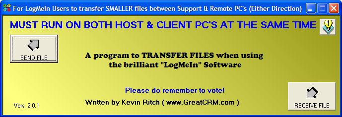

## Log\-Me\-In \(LogMeIn\) File Transfer via Shared Clipboard

### Description

LogMeIn is a FREE support program that looks and behaves rather like PCAnywhere. The free version excludes the ability to transfer files. Pay them some money, and you get the privilage.

My program provides a way to TRANSFER FILES via a SHARED Windows Clipboard as used by LogMeIn.

Thus, if you need to just transfer some small files (under 1.5 Megs) such as replacement EXE's or DLL's etc., my program makes that possible for FREE.

For the uninitiated, LogMeIn works over the Internet and lets you work in a window on your PC that contains your client's screen. It behaves just as though you were actually sat in front of your client's PC.

because the TEXT CLIPBOARD is synchronized between the two PC's, you copy text to the clipboard on either PC and the Clipboard.GetText function in VB will retrieve it.

In my progrtam you select a file. The program converts the binary data in that file to an ASCII (HEX) equivalent using Clipboard.SetText to set it to the SHARED Windows Clipbaord.

On the REMOTE PC (or your own just to test it) the SAVE_AS button does the reverse. It uses the Clipboard.GetText function to retrieve the ASCII and converts it back to binary and restores the file!

Voila! You have "Transferred" the file via the SHARED TEXT CLIPBOARD!
 
### More Info
 
You cannot do other things with the Windows TEXT Clipboard during a file transfer. Again, that may seem obvious, but it must be mentioned. :-)

ENJOY!

DO NOT USE FOR LARGE FILES (Say in excess of 2 Megabytes)

             |
---                |---
**Submitted On**   |2006-10-01 14:34:52
**By**             |[Kevin Ritch](https://github.com/Planet-Source-Code/PSCIndex/blob/master/ByAuthor/kevin-ritch.md)
**Level**          |Advanced
**User Rating**    |4.7 (14 globes from 3 users)
**Compatibility**  |VB 4\.0 \(32\-bit\), VB 5\.0, VB 6\.0
**Category**       |[Complete Applications](https://github.com/Planet-Source-Code/PSCIndex/blob/master/ByCategory/complete-applications__1-27.md)
**World**          |[Visual Basic](https://github.com/Planet-Source-Code/PSCIndex/blob/master/ByWorld/visual-basic.md)
**Archive File**   |[Log\-Me\-In\-2022641012006\.zip](https://github.com/Planet-Source-Code/kevin-ritch-log-me-in-logmein-file-transfer-via-shared-clipboard__1-66678/archive/master.zip)

